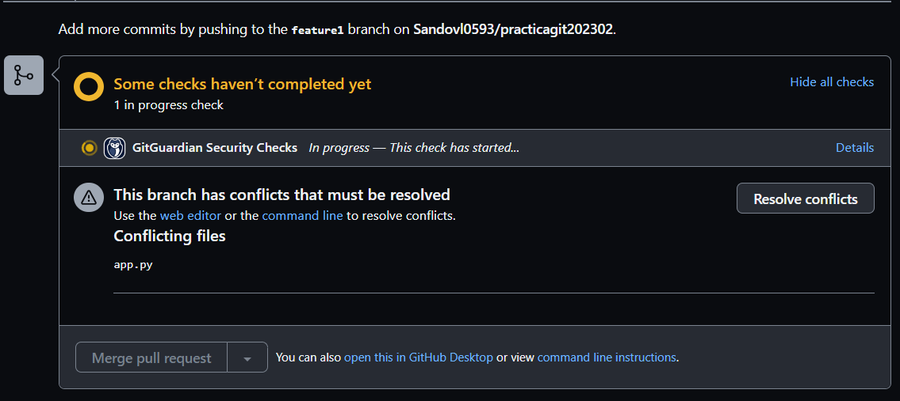
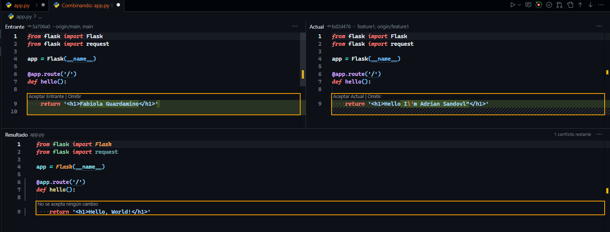

# Actividad 1

## Integrantes

- Adrian Sandoval Huamaní
- Fabiola Abigail Guardamino Morales

## Comandos utilizados

- Fabiola Abigail Guardamino Morales

```bash
# modify app.py

git branch
gir checkout new-branch
git add app.py
git commit -m "Create New-branch"
git push --set-upstream origin new-branch

# merge to main

git pull
git merge main

# merged branch in Github
```


- Adrian Sandoval

```bash
# modify app.py

git branch feature1
gir checkout feature1
git add app.py
git commit -m "Mi modificacion"
git push --set-upstream origin feature1

# merge to main

git pull
git merge main
git rebase
git status
```


*Automatic merge commit "Update app.py" in VsCode*


```bash
git checkout main
gir commit -m "Segunda modificacion"
git push --set-upstream origin main
```